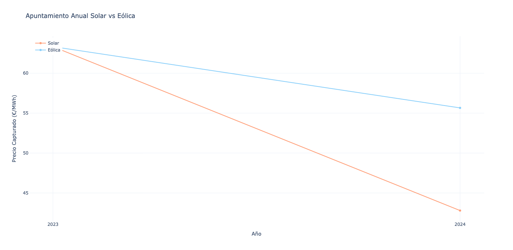
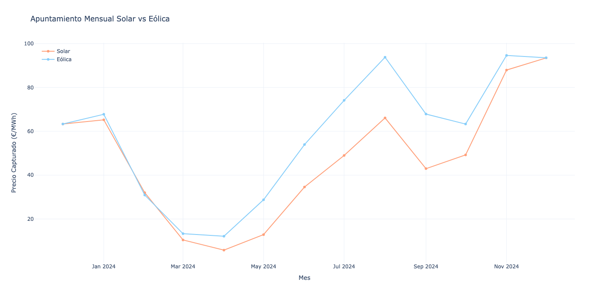
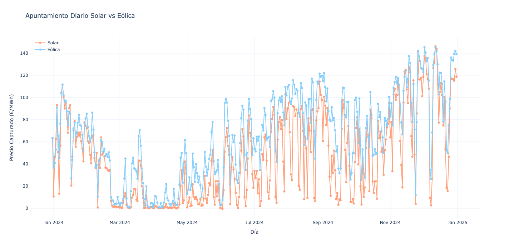

# Prueba sobre apuntamiento Precio Capturado de Energías Renovables ☀️🌬️

Este trabajo procesa datos de precios y volúmenes de generación solar (fotovoltaica) y eólica para calcular el **apuntamiento del precio capturado** por cada tecnología en períodos diario, mensual y anual.

## Pasos realizados

1. **Descarga y carga de datos**  
   Se importan archivos Excel con datos horarios de precios, volumen fotovoltaico y volumen eólico.

2. **Unificación y limpieza**  
   Se crea un DataFrame con fecha, año, mes, día, hora, precio, volumen solar y volumen eólico. Se guarda el dataset limpio en Excel.

3. **Cálculo de apuntamiento**  
   Se calcula el apuntamiento como el promedio ponderado del precio capturado por tecnología en los distintos periodos (diario, mensual y anual). Los resultados se exportan a Excel para revisión.

4. **Visualización**  
   Se generan gráficos interactivos con la librería Plotly, mostrando la evolución del apuntamiento para ambas tecnologías.

## Instrucciones para ejecutar y generar archivos

Para ejecutar este proyecto correctamente, se deberán seguir estos pasos:

1. **Archivos base necesarios**  
   Asegúrate de tener los siguientes archivos Excel con los datos horarios en la misma carpeta que el script, todos ellos disponibles en el repositorio:
   - `Precios.xlsx` — con columnas `datetime` y `value` para los precios horarios.
   - `Fotovoltaica.xlsx` — con columnas `datetime` y `value` para el volumen fotovoltaico horario.
   - `Eolica.xlsx` — con columnas `datetime` y `value` para el volumen eólico horario.

2. **Ejecutar el script**  
   Corre el script Python (Prueba_Marite.py) desde Visual Studio Code.

3. **Archivos generados**  
   Al finalizar, el script generará:
   - "datos_limpios_unidos.xlsx" — contiene los datos combinados con columnas de fecha, hora, precio y volúmenes.
   - "apuntamientos_generacion.xlsx" — contiene los resultados del apuntamiento diario, mensual y anual para cada tecnología.
   - Tres archivos HTML interactivos con gráficos:  
     "grafico_apuntamiento_diario.html" 
     "grafico_apuntamiento_mensual.html"  
     "grafico_apuntamiento_anual.html"

4. **Revisión de resultados**  
   Si se desea revisar con más detalle, los archivos Excel con los datos base y los apuntamientos estan disponibles, y los archivos HTML pueden ser abiertos en cualquier navegador para visualizar los gráficos interactivos.

## Resultados y conclusiones 

1. Visión Anual

Al ver los datos del año completo, se nota una diferencia importante: la eólica logró capturar unos 55−56 €/MWh, mientras que la solar se quedó en 42−43 €/MWh.
¿La razón? La canibalización solar. Como la fotovoltaica genera sobre todo al mediodía (cuando hay mucha oferta de otras plantas solares) eso hace que el precio baje justo cuando más produce. La eólica, en cambio, reparte mejor su generación durante el día y la noche, lo que le ayuda a evitar ese bajón en el valor de su energía.

2. Comportamiento Mensual

Cuando se analiza mes a mes, se ve una estacionalidad clara. En el primer trimestre, sobre todo en marzo, los precios capturados estuvieron bastante bajos, seguramente por una mezcla de mucha producción y poca demanda.
En verano, la eólica tuvo un pico interesante (agosto, arriba de los 90 €/MWh). La solar se recuperó más hacia el final del año, con valores cercanos a los 90−92 €/MWh en octubre y noviembre.
Esto puede deberse a que, en esos meses con días más cortos o menos producción eólica, la solar tiene más espacio para destacar y obtener mejores precios.

3. Comportamiento Diario

Al ver los datos día por día, lo que salta es la alta volatilidad en los precios capturados. Hay días en los que el precio casi llega a cero o incluso es negativo (por ejemplo, en marzo y abril), lo que indica momentos con muchísima generación y no tanta demanda. Pero también hubo días con precios altísimos, superando los 120 €/MWh.
Ambas tecnologías sufren esta montaña rusa de precios, pero la solar parece tener más días con precios muy bajos, mientras que la eólica, aunque también es inestable, tiene más oportunidades de aprovechar los picos altos.

Conclusiones

🔹 Diferencia de Valor
En 2024, la eólica sacó bastante ventaja sobre la solar en cuanto a precio promedio. Este gap es clave para evaluar qué tan rentable es cada tecnología y muestra cómo la canibalización afecta más a la solar.

🔹 Volatilidad y Temporada
El mercado español está lleno de subidas y bajadas diarias, y además cambia bastante según la época del año. Entender esto es súper importante para poder planear bien y maximizar los ingresos.

🔹 Posible solución
Una buena forma de protegerse frente a estos altibajos es combinar tecnologías (solar + eólica + baterías), firmar contratos PPA que fijen precios a largo plazo, y sobre todo para la solar, incorporar almacenamiento. Eso permitiría guardar energía y venderla cuando realmente vale más, mejorando su capacidad de adaptarse al mercado.

